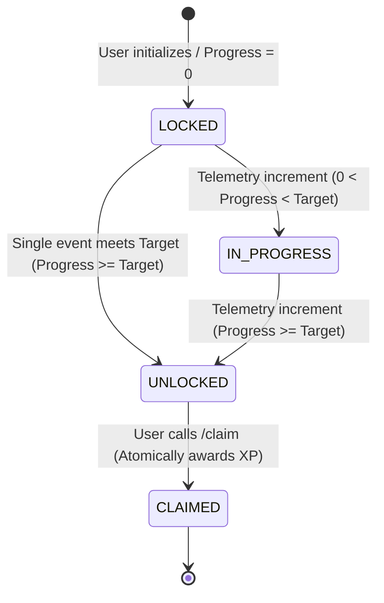

# 🎯 Task 7: Achievement State Machine Specification

**Workstream:** Planning & Audit  
**Status:** Approved & Authoritative  
**Target Entities:** `user_achievements`, `user_achievement_metrics`, `achievement_definitions`  

---

## 1. Executive Summary & Core Philosophy

The FieldFlicks Achievement Engine governs player progression across gamification milestones. Every user-achievement relationship is modeled as a deterministic finite-state machine (FSM) adhering to four distinct lifecycle states:

$$\text{LOCKED} \xrightarrow{\text{telemetry}} \text{IN\_PROGRESS} \xrightarrow{\text{threshold reached}} \text{UNLOCKED} \xrightarrow{\text{user claim}} \text{CLAIMED}$$

### Guiding Principles
1. **Monotonic Forward Progression (No Regressions):** An achievement that reaches `UNLOCKED` or `CLAIMED` status is a permanent lifetime milestone and **cannot revert** under any circumstances (e.g., deleted shorts, lapsed streaks, or metric resets).
2. **Idempotent Rewards:** XP rewards are distributed strictly once per achievement. Double-claims via racing HTTP requests or concurrent telemetry triggers are precluded via database-level row locking (`SELECT FOR UPDATE`).
3. **Decoupled Evaluation & Claim:** Metric accumulation occurs asynchronously via telemetry events, while reward claiming is an explicit, user-initiated action that provides agency and positive psychological reinforcement.

---

## 2. State Machine Diagram



---

## 3. Comprehensive State Definitions

| State | Definition | Visual Representation | Interaction & Authorization Rules |
| :--- | :--- | :--- | :--- |
| **`LOCKED`** | Telemetry metric is strictly $0$ or no metric row exists for the user. | Desaturated badge artwork (greyscale / opacity 0.35), lock glyph overlay, muted grey progress bar at 0%. | Cannot be claimed. Tapping displays requirement details, target threshold, and prerequisite actions. |
| **`IN_PROGRESS`** | Telemetry metric is $> 0$ but strictly $< \text{TargetValue}$. | Semi-vibrant badge, neon accent borders, dynamic progress bar fill (e.g. 45%), progress counter (`12 / 50 Matches`). | Cannot be claimed. Serves as active motivator; displays live distance-to-goal and associated XP reward. |
| **`UNLOCKED`** *(Earned)* | Metric value $\ge \text{TargetValue}$ and reward has not yet been claimed (`isRewardClaimed == false`). | Full vibrant badge artwork with radiant neon aura/glow, pulsating badge ring, golden `+XP` reward tag. | Active "Claim Reward" CTA button with haptic feedback trigger. Eligible for celebratory modal popup. |
| **`CLAIMED`** | Reward XP has been credited to user balance (`isRewardClaimed == true`). | Fully saturated badge artwork, subdued ambient border, green checkmark pill (`Claimed`). | "Claimed" label; button permanently disabled. XP reflected in profile and Infinite Levels progression. |

---

## 4. Transition Guard Matrix & Invariants

| Transition ID | Origin State | Destination State | Guard Condition | Engine Side Effects |
| :--- | :--- | :--- | :--- | :--- |
| **T1: Initialize** | *None* | `LOCKED` | New user registered, or new achievement seeded in catalog. | Inserts row into `user_achievements` with `currentProgress = 0`, `status = 'LOCKED'`, `isCompleted = false`, `isRewardClaimed = false`. |
| **T2: Progress** | `LOCKED` | `IN_PROGRESS` | $0 < \text{newProgress} < \text{targetValue}$ | Updates `currentProgress = newProgress`, `status = 'IN_PROGRESS'`, `updatedAt = NOW()`. |
| **T3: Advance** | `IN_PROGRESS` | `IN_PROGRESS` | $\text{oldProgress} < \text{newProgress} < \text{targetValue}$ | Updates `currentProgress = newProgress`, `updatedAt = NOW()`. |
| **T4: Complete** | `LOCKED` \| `IN_PROGRESS` | `UNLOCKED` | $\text{newProgress} \ge \text{targetValue} \land \text{isCompleted} == \text{false}$ | Sets `isCompleted = true`, `completedAt = NOW()`, `status = 'UNLOCKED'`, `currentProgress = newProgress`. Dispatches `AchievementUnlockedEvent` (triggers push notification / modal payload). |
| **T5: Claim** | `UNLOCKED` | `CLAIMED` | $\text{isCompleted} == \text{true} \land \text{isRewardClaimed} == \text{false}$ | Locks row (`FOR UPDATE`), sets `isRewardClaimed = true`, `claimedAt = NOW()`, `status = 'CLAIMED'`. Invokes `PointsService.awardPoints` with `achievement_claim` event type. Re-evaluates infinite level progression. |

---

## 5. Critical Edge Cases & Safety Invariants

### 5.1 Metric Reversals & Non-Regression Invariant
- **Scenario:** A user breaks an active 10-day streak (streak drops to 0), or deletes an uploaded FlickShort after having unlocked `CRE_FIRST_REEL` or `ATH_CONSISTENT_PLAYER`.
- **Rule:** Completed and unlocked achievements are immutable player credentials. Once `isCompleted = true` or status is `UNLOCKED` / `CLAIMED`, an achievement **never** transitions backwards to `IN_PROGRESS` or `LOCKED`.
- **Database Safeguard:**
  ```sql
  UPDATE user_achievements
  SET currentProgress = GREATEST(currentProgress, $newProgress)
  WHERE userId = $userId AND achievementId = $achievementId AND isCompleted = false;
  ```

### 5.2 Metric Overflow & UI Normalization
- **Scenario:** An event awards batch progress that exceeds target (e.g. target is 50 matches, batch import moves user from 48 to 55).
- **Rule:** `currentProgress` records raw authoritative telemetry ($55$), but presentation layer clamps calculated percentage:
  $$\text{progressPercent} = \min\left(100, \left\lfloor \frac{\text{currentProgress}}{\text{targetValue}} \times 100 \right\rfloor \right)$$
- `status` transitions cleanly to `UNLOCKED`.

### 5.3 Concurrency & Idempotent Claiming
- **Scenario:** User double-clicks "Claim Reward" in high-latency network conditions, sending twin `POST /api/v1/achievements/:id/claim` requests within milliseconds.
- **Rule:** Claims execute within an atomic PostgreSQL database transaction using row-level locking:
  ```sql
  SELECT * FROM user_achievements
  WHERE "userId" = $1 AND "achievementId" = $2
  FOR UPDATE;
  ```
  If `isRewardClaimed == true`, the second transaction immediately aborts with `409 Conflict` ("Achievement reward already claimed") without invoking `PointsService.awardPoints`.

### 5.4 Out-of-Order / Batch Telemetry Execution
- **Scenario:** Multiple telemetry events arrive concurrently or out of order from asynchronous job workers (e.g., multiple video highlight conversions).
- **Rule:** Aggregator metrics update using SQL atomic increments (`matchesPlayed = matchesPlayed + 1`) or `GREATEST()` functions for peak metrics (`peakLikesSingleShort = GREATEST(peakLikesSingleShort, $likes)`). Evaluation compares updated aggregates against definitions.

### 5.5 Retroactive Catalog Seeding & Backfill
- **Scenario:** A new achievement definition is published for an activity users have already accumulated metrics for (e.g., user already has 12 matches played when `ATH_REGULAR_STARTER` is seeded).
- **Rule:** During backfill evaluation, the user record is immediately evaluated against their `user_achievement_metrics` baseline:
  - If `metrics.matchesPlayed >= definition.targetValue`, the row directly initializes in `UNLOCKED` state with `currentProgress = metrics.matchesPlayed`, `isCompleted = true`, `completedAt = NOW()`, ready for claim.
